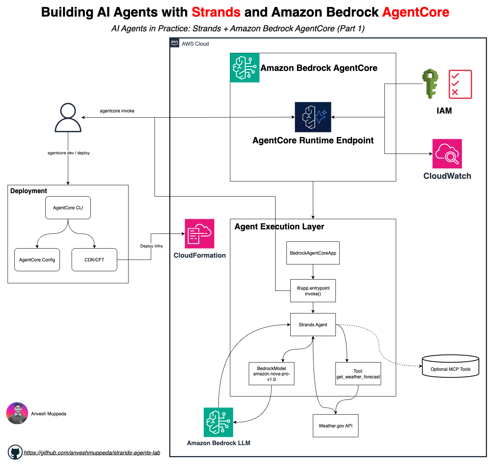

# Building AI Agents with Strands and Amazon Bedrock AgentCore | (Part 1)
## *Architecture, Deployment, and Real-Time Tool Execution with Serverless LLMs*

A production-ready weather assistant that fetches live forecasts from the [National Weather Service (NWS) API](https://www.weather.gov/documentation/services-web-api), powered by an LLM running on [Amazon Bedrock](https://aws.amazon.com/bedrock/), and deployed to [Amazon Bedrock AgentCore](https://aws.amazon.com/bedrock/agentcore/) Runtime.

This agent covers the full lifecycle — from a Python script running on your laptop to a managed, scalable serverless endpoint on AWS — with the same core agent code throughout.

---

## What Is This?

This is not a traditional weather app that calls an API and formats the response. It is an **AI agent** — a program where a Large Language Model (LLM) decides what to do, calls tools, reads the results, and reasons its way to a final answer.

The difference matters:

| Traditional App | AI Agent |
|-----------------|----------|
| You write: "call weather API, format result, return" | You write: a tool that can fetch weather |
| Logic is hardcoded in your code | Logic is driven by the LLM at runtime |
| Fixed input → fixed output path | LLM decides which tools to call and in what order |
| Adding a new capability = rewriting flow logic | Adding a new capability = adding a new tool |

With an agent, you describe *what* tools can do. The LLM figures out *when* and *how* to use them.

---

## Architecture



The agent follows a **model-driven loop**:

```
User Query
    │
    ▼
Strands Agent
    ├── System Prompt  →  defines the agent's role and rules
    ├── BedrockModel   →  LLM reasoning engine (Amazon Bedrock)
    └── Tools          →  get_weather_forecast (custom @tool → NWS API)
         │
         └── Agent Loop
               Think → Act → Observe → Decide → Respond
                              │
                              ▼
                        NWS Weather API
                        api.weather.gov
```

---

## Tech Stack

| Component | Technology |
|-----------|-----------|
| Agent Framework | [Strands Agents SDK](https://strandsagents.com) (open source, by AWS) |
| LLM | Amazon Nova Pro via [Amazon Bedrock](https://aws.amazon.com/bedrock/) |
| Authentication | AWS IAM credentials — no API keys |
| Weather Data | [National Weather Service API](https://www.weather.gov/documentation/services-web-api) (free, no key required) |
| Production Runtime | [Amazon Bedrock AgentCore](https://aws.amazon.com/bedrock/agentcore/) |
| Infrastructure | AWS CDK (managed by AgentCore CLI) |

---

## How the Agent Loop Works

When you ask "What's the weather in Chicago?", here is exactly what happens:

```
You:    "What's the weather in Chicago?"

THINK   The LLM reads your message, the system prompt, and the
        available tool schemas. It decides: "I need to call
        get_weather_forecast with city='Chicago'"

ACT     Strands SDK executes get_weather_forecast("Chicago")
        → Tool calls NWS API: GET api.weather.gov/points/41.8781,-87.6298
        → Gets forecast endpoint URL
        → GET {forecast_url}
        → Returns forecast periods

OBSERVE The tool result is sent back to the LLM:
        "Chicago: Today: 72°F, Sunny, Wind: 10 mph SW
                  Tonight: 58°F, Clear, Wind: 5 mph SW"

DECIDE  The LLM has enough information. No more tool calls needed.

RESPOND "Chicago is looking great today! It's currently 72°F and
         sunny with light 10 mph winds from the southwest. Tonight
         will cool down to 58°F with clear skies."
```

The LLM drives every decision. Your Python code just provides the tools.

---

## The Core Tool: `get_weather_forecast`

The entire weather capability lives in one custom tool:

```python
@tool
def get_weather_forecast(city: str) -> str:
    """Get the weather forecast for a US city using the National Weather Service API.

    Args:
        city: Name of a US city (e.g., "New York", "Chicago", "San Francisco")
    """
    city_coords = {
        "new york":     (40.7128, -74.0060),
        "chicago":      (41.8781, -87.6298),
        "san francisco":(37.7749, -122.4194),
        "miami":        (25.7617, -80.1918),
        "seattle":      (47.6062, -122.3321),
        "los angeles":  (34.0522, -118.2437),
        "denver":       (39.7392, -104.9903),
        "boston":       (42.3601, -71.0589),
    }

    coords = city_coords.get(city.lower())
    if not coords:
        return f"City '{city}' not found. Supported: {', '.join(city_coords.keys())}"

    try:
        # Step 1: Resolve coordinates to a forecast endpoint
        point_url = f"https://api.weather.gov/points/{coords[0]},{coords[1]}"
        req = urllib.request.Request(point_url, headers={"User-Agent": "WeatherAgent/1.0"})
        with urllib.request.urlopen(req, timeout=10, context=_ssl_context) as resp:
            point_data = json.loads(resp.read())

        # Step 2: Fetch the actual forecast
        forecast_url = point_data["properties"]["forecast"]
        req = urllib.request.Request(forecast_url, headers={"User-Agent": "WeatherAgent/1.0"})
        with urllib.request.urlopen(req, timeout=10, context=_ssl_context) as resp:
            forecast_data = json.loads(resp.read())

        # Return the first 4 forecast periods
        periods = forecast_data["properties"]["periods"][:4]
        result = []
        for p in periods:
            result.append(
                f"  {p['name']}: {p['temperature']}°{p['temperatureUnit']}, "
                f"{p['shortForecast']}, Wind: {p['windSpeed']} {p['windDirection']}"
            )
        return f"Weather forecast for {city}:\n" + "\n".join(result)

    except Exception as e:
        return f"Error fetching weather: {str(e)}"
```

### What the `@tool` Decorator Does

The decorator converts your function into a JSON schema that the LLM reads to decide when and how to call it:

```json
{
  "name": "get_weather_forecast",
  "description": "Get the weather forecast for a US city using the National Weather Service API.",
  "inputSchema": {
    "type": "object",
    "properties": {
      "city": {
        "type": "string",
        "description": "Name of a US city (e.g., \"New York\", \"Chicago\", \"San Francisco\")"
      }
    },
    "required": ["city"]
  }
}
```

The LLM never sees your Python code — only this schema. It reads the name, description, and parameter descriptions to decide when to call the tool and what arguments to pass.

### The Two-Step NWS API Call

The NWS API doesn't accept city names directly. It requires coordinates, and returns a forecast endpoint URL specific to that grid point:

```
Step 1: GET https://api.weather.gov/points/{lat},{lon}
        Response: { "properties": { "forecast": "https://api.weather.gov/gridpoints/LOT/65,77/forecast" } }

Step 2: GET https://api.weather.gov/gridpoints/LOT/65,77/forecast
        Response: { "properties": { "periods": [ { "name": "Today", "temperature": 72, ... } ] } }
```

The tool handles both steps transparently. The LLM just calls `get_weather_forecast("Chicago")` and gets back formatted text.

---

## Supported Cities

| City | Coordinates |
|------|-------------|
| New York | 40.7128°N, 74.0060°W |
| Chicago | 41.8781°N, 87.6298°W |
| San Francisco | 37.7749°N, 122.4194°W |
| Miami | 25.7617°N, 80.1918°W |
| Seattle | 47.6062°N, 122.3321°W |
| Los Angeles | 34.0522°N, 118.2437°W |
| Denver | 39.7392°N, 104.9903°W |
| Boston | 42.3601°N, 71.0589°W |

---

## Implementations

This agent has two versions that share the same core tool and system prompt:

| Version | How It Runs | Entry Point | Use Case |
|---------|-------------|-------------|----------|
| [Local](./local/) | `python3 weather_agent.py` | `if __name__ == "__main__"` loop | Development, learning, testing |
| [AgentCore](./agentcore/) | Managed container on AWS | `@app.entrypoint` async generator | Production, scalable deployment |

---

## Version 1: Local

The local version runs as a Python script with an interactive conversation loop.

### Project Structure

```
local/
├── weather_agent.py    # Agent code
├── requirements.txt    # Python dependencies
└── README.md
```

### Key Code

```python
from strands import Agent, tool
from strands.models.bedrock import BedrockModel

model = BedrockModel(
    model_id="us.anthropic.claude-sonnet-4-20250514-v1:0",
    region_name=os.environ.get("AWS_DEFAULT_REGION", "us-east-1"),
    max_tokens=4096,
)

SYSTEM_PROMPT = """You are a helpful weather assistant.
Use get_weather_forecast to check weather for US cities.
Always use the tool to get real data — never make up weather information.
Format responses clearly with temperature, conditions, and wind."""

agent = Agent(
    model=model,
    system_prompt=SYSTEM_PROMPT,
    tools=[get_weather_forecast],
)

# Interactive loop
while True:
    user_input = input("\nYou: ").strip()
    if user_input.lower() in ("quit", "exit", "q"):
        break
    response = agent(user_input)
```

### Setup & Run

```bash
cd agents/weather-agent/local

# Create virtual environment
python3 -m venv .venv
source .venv/bin/activate

# Install dependencies
pip install -r requirements.txt

# Run
python3 weather_agent.py
```

### Prerequisites

- Python 3.10+
- AWS CLI configured: `aws configure`
- Bedrock model access enabled in [AWS Console](https://console.aws.amazon.com/bedrock/home#/modelaccess)

### Sample Session

```
Weather Agent (type 'quit' to exit)
----------------------------------------

You: What's the weather in Seattle?

Agent: Here's the current forecast for Seattle:

  Today: 58°F, Mostly Cloudy, Wind: 10 mph SW
  Tonight: 48°F, Chance Rain, Wind: 8 mph S
  Tomorrow: 62°F, Partly Sunny, Wind: 12 mph W
  Tomorrow Night: 50°F, Mostly Clear, Wind: 5 mph NW

You: What about Denver?

Agent: Denver is looking quite different from Seattle right now:

  Today: 78°F, Sunny, Wind: 15 mph NW
  Tonight: 55°F, Clear, Wind: 8 mph N
  ...
```

The agent maintains conversation context — it remembers you already asked about Seattle when you ask about Denver.

### macOS SSL Note

The NWS API uses HTTPS. Python on macOS sometimes ships without root certificates, causing SSL errors. The agent handles this automatically with a fallback. For a permanent fix:

```bash
# Install certificates for your Python version
open /Applications/Python\ 3.x/Install\ Certificates.command

# Or install certifi
pip install certifi
```

---

## Version 2: Amazon Bedrock AgentCore

The AgentCore version wraps the same agent with `BedrockAgentCoreApp`, turning it into a managed serverless endpoint on AWS.

### What Changes

| Aspect | Local | AgentCore |
|--------|-------|-----------|
| Entry point | `if __name__ == "__main__"` loop | `@app.entrypoint` async generator |
| Invocation | `python3 weather_agent.py` | HTTP POST to `/invocations` |
| Scaling | Single process on your machine | Auto-scales on demand |
| Auth | Local `aws configure` credentials | IAM role auto-provisioned by CLI |
| Monitoring | Print statements | OpenTelemetry traces → CloudWatch |
| Memory | Lost when terminal closes | Persistent via AgentCore Memory (optional) |
| Infrastructure | None | CDK-managed IAM roles, runtime endpoint |

The agent logic — the tool, the system prompt, the model — stays identical.

### Project Structure

```
agentcore/
└── weatheragent/
    ├── agentcore/
    │   ├── agentcore.json      # Project config (source of truth)
    │   ├── aws-targets.json    # Deployment target (account, region)
    │   └── cdk/                # CDK infrastructure (auto-managed by CLI)
    └── app/
        └── weatheragent/
            ├── main.py         # Agent code with @app.entrypoint
            ├── model/
            │   └── load.py     # BedrockModel configuration
            └── pyproject.toml  # Python dependencies
```

### Key Code: Entry Point (`main.py`)

```python
from strands import Agent, tool
from bedrock_agentcore.runtime import BedrockAgentCoreApp
from model.load import load_model

app = BedrockAgentCoreApp()
log = app.logger

# --- Tool (same as local version) ---
@tool
def get_weather_forecast(city: str) -> str:
    """Get the weather forecast for a US city using the National Weather Service API.

    Args:
        city: Name of a US city (e.g., "New York", "Chicago", "San Francisco")
    """
    # ... same implementation as local version

# --- Agent singleton (reused across invocations for warm start) ---
_agent = None

def get_or_create_agent():
    global _agent
    if _agent is None:
        _agent = Agent(
            model=load_model(),
            system_prompt=SYSTEM_PROMPT,
            tools=[get_weather_forecast],
        )
    return _agent

# --- AgentCore Runtime Entrypoint ---
@app.entrypoint
async def invoke(payload, context):
    log.info("Invoking Weather Agent...")
    agent = get_or_create_agent()
    stream = agent.stream_async(payload.get("prompt"))
    async for event in stream:
        if "data" in event and isinstance(event["data"], str):
            yield event["data"]

if __name__ == "__main__":
    app.run()
```

Three things changed from the local version:

1. `BedrockAgentCoreApp()` — provides the HTTP server and runtime lifecycle
2. `@app.entrypoint` — the handler AgentCore calls on each HTTP invocation
3. `agent.stream_async()` + `yield` — streams tokens back to the caller as they're generated

### Key Code: Model (`model/load.py`)

```python
from strands.models.bedrock import BedrockModel

def load_model() -> BedrockModel:
    """Get Bedrock model client using IAM credentials."""
    return BedrockModel(model_id="amazon.nova-pro-v1:0")
```

Separated from the agent logic so the model can be swapped without touching `main.py`.

### Prerequisites

- Node.js 20.x or later
- Python 3.10+ with `uv` ([install](https://docs.astral.sh/uv/getting-started/installation/))
- AWS CLI configured with Bedrock + CloudFormation permissions
- AgentCore CLI:

```bash
npm install -g @aws/agentcore --prefix ~/.npm-global
agentcore --version
```

### Step 1 — Test Locally with `agentcore dev`

```bash
cd agents/weather-agent/agentcore/weatheragent
agentcore dev
```

This starts a local HTTP server at `http://localhost:8080/invocations` and opens an interactive chat. The agent runs exactly as it will in production — same container, same entrypoint, same model.

```
Dev Server

  Agent: weatheragent
  Server: http://localhost:8080/invocations
  Status: running

  > What's the weather in Boston?

  Boston is experiencing mild conditions today:
    Today: 68°F, Partly Cloudy, Wind: 12 mph NE
    Tonight: 55°F, Mostly Clear, Wind: 8 mph N
```

To test non-interactively:

```bash
# Terminal 1 — start the server
agentcore dev --logs

# Terminal 2 — send a request
agentcore dev "What's the weather in Miami?" --stream
```

### Step 2 — Deploy to AWS

```bash
agentcore deploy
```

This packages your agent code as a zip artifact, runs CDK to provision IAM roles and the AgentCore Runtime endpoint, uploads the artifact, and activates the runtime.

Check status:

```bash
agentcore status
```

```
AgentCore Status (target: default, us-east-1)

Agents
  weatheragent: Deployed - Runtime: READY (arn:aws:bedrock-agentcore:...)
```

### Step 3 — Invoke the Deployed Agent

```bash
agentcore invoke "What's the weather in New York?" --stream
```

### Step 4 — View Logs and Traces

```bash
agentcore logs
agentcore traces list --limit 10
```

### Extending with AgentCore Features

Once deployed, you can add production capabilities incrementally:

**Memory** — remember conversations across sessions:

```bash
agentcore add memory \
  --name WeatherMemory \
  --strategies SEMANTIC,SUMMARIZATION \
  --expiry 30

agentcore deploy
```

**Evaluations** — automatically monitor response quality:

```bash
agentcore add online-eval \
  --name QualityMonitor \
  --agent weatheragent \
  --evaluator Builtin.GoalSuccessRate \
  --sampling-rate 100 \
  --enable-on-create

agentcore deploy
```

**Gateway** — expose the agent's tools to other agents via MCP:

```bash
agentcore add gateway \
  --name weather-gateway \
  --runtimes weatheragent

agentcore deploy
```

### Clean Up

```bash
agentcore remove all
agentcore deploy
```

---

## Troubleshooting

**`AccessDeniedException` — INVALID_PAYMENT_INSTRUMENT**

The model requires Bedrock model access to be enabled and a valid payment method on the AWS account. Go to [Bedrock Console → Model Access](https://console.aws.amazon.com/bedrock/home#/modelaccess) and enable the model. If the issue persists, check [AWS Billing](https://console.aws.amazon.com/billing/home#/paymentmethods).

**`ValidationException` — on-demand throughput not supported**

Some model IDs (e.g., `anthropic.claude-sonnet-4-20250514-v1:0`) require a cross-region inference profile. Use the `us.` prefixed version (`us.anthropic.claude-sonnet-4-20250514-v1:0`) or switch to `amazon.nova-pro-v1:0` which supports on-demand throughput directly.

**SSL errors calling NWS API**

The agent uses `ssl._create_unverified_context()` as a fallback for environments without root certificates installed. This is safe for the public read-only NWS API.

---

## Resources

| Resource | Link |
|----------|------|
| Strands Agents SDK | https://strandsagents.com/latest/ |
| Amazon Bedrock | https://aws.amazon.com/bedrock/ |
| Amazon Bedrock AgentCore | https://aws.amazon.com/bedrock/agentcore/ |
| AgentCore Docs | https://docs.aws.amazon.com/bedrock-agentcore/ |
| AgentCore CLI | https://github.com/aws/agentcore-cli |
| AgentCore Python SDK | https://github.com/aws/bedrock-agentcore-sdk-python |
| NWS Weather API | https://www.weather.gov/documentation/services-web-api |
| Getting Started Workshop | https://catalog.us-east-1.prod.workshops.aws/workshops/850fcd5c-fd1f-48d7-932c-ad9babede979 |
| AgentCore Deep Dive Workshop | https://catalog.workshops.aws/agentcore-deep-dive |
