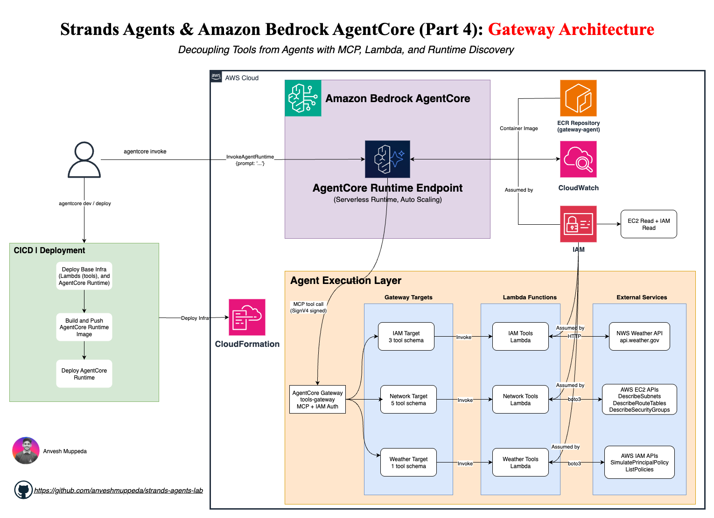
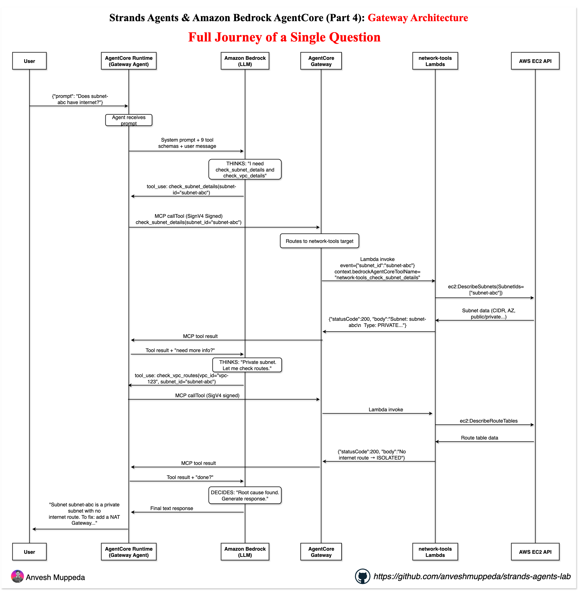

# Strands Agents & Amazon Bedrock AgentCore (Part 4): Gateway Architecture

## *From Tools-in-Code to Tools-as-a-Service: Centralizing Agent Tools with MCP*

A single agent that accesses weather, network, and IAM tools through **AgentCore Gateway**
instead of having tools baked into the agent code. The agent has zero tool implementations —
it discovers all 9 tools at runtime via MCP.

> **Prerequisite:** Complete [01-weather-agent](../01-weather-agent/), [02-network-agent](../02-network-agent/),
> and [03-network-agent-cdk](../03-network-agent-cdk/) first. This guide assumes you understand
> Strands agents, `@tool`, AgentCore Runtime, and Python CDK.

---

## Architecture  


## Request Flow — Step by Step


## Why Gateway?

In the previous agents, tools lived inside the agent code:

```python
# 01-weather-agent and 02-network-agent: tools baked in
agent = Agent(tools=[get_weather_forecast, check_subnet_details, ...])
```

This works for one agent. But when you have multiple agents sharing tools, or 50+ tools
that need independent scaling, you need to separate tools from agents.

| Tools in Agent (before) | Tools in Gateway (this project) |
|-------------------------|----------------------------------|
| Tool code lives in the agent container | Tool code lives in Lambda functions |
| Change a tool → redeploy the agent | Change a tool → redeploy only the Lambda |
| Each agent carries its own tools | All agents connect to the same Gateway |
| API keys in agent code/env vars | API keys in Secrets Manager via Gateway |
| Tools scale with the agent | Tools scale independently (Lambda) |
| Agent discovers tools at build time | Agent discovers tools at runtime via MCP |

---

## Architecture

```
┌─ Stack 1: ToolsGateway (base infra — deploy once) ──────────────┐
│                                                                   │
│  ECR Repository (gateway-agent)                                   │
│  3 Lambda Functions (weather, network, IAM tools)                 │
│  Gateway IAM Role                                                 │
│  AgentCore Gateway (MCP endpoint, IAM auth)                       │
│  3 Gateway Targets (one per Lambda, with tool schemas)            │
│                                                                   │
└───────────────────────────────────────────────────────────────────┘
          │                    │
          │ ECR URI            │ Gateway ID → GATEWAY_URL
          ▼                    ▼
┌─ Stack 2: GatewayAgent-Runtime (updates per deploy) ─────────────┐
│                                                                   │
│  AgentCore IAM Role (Bedrock + ECR + Gateway invoke)              │
│  AgentCore Runtime                                                │
│    ├── container_uri: {ECR_URI}:{image_tag}                       │
│    └── env: GATEWAY_URL=https://{gateway_id}.gateway...           │
│                                                                   │
└───────────────────────────────────────────────────────────────────┘
```

The `GATEWAY_URL` is automatically constructed from the Gateway ID and passed to the
Runtime as an environment variable — no hardcoding needed.

---

## How It Works Step by Step

```
User: "Does subnet-abc have internet access?"

 1. Agent receives the question
 2. Agent's MCP client calls Gateway's listTools → gets 9 tool schemas
 3. LLM reads all 9 schemas, decides: "I need check_subnet_details and check_vpc_routes"
 4. Agent sends MCP tool call to Gateway: check_subnet_details(subnet_id="subnet-abc")
 5. Gateway looks up which target owns "check_subnet_details" → network-tools
 6. Gateway invokes network-tools Lambda with:
    - event = {"subnet_id": "subnet-abc"}
    - context.client_context.custom = {"bedrockAgentCoreToolName": "network-tools___check_subnet_details"}
 7. Lambda strips the prefix, calls check_subnet_details("subnet-abc")
 8. Lambda returns: {"statusCode": 200, "body": "Subnet: subnet-abc\n  Type: PRIVATE\n  ..."}
 9. Gateway passes result back to agent via MCP
10. LLM reads result, calls check_vpc_routes next, then responds to user
```

---

## Project Structure

```
04-gateway-agent/
│
├── cdk/                                    # Infrastructure (two stacks)
│   ├── app.py                              # CDK app — wires both stacks
│   ├── cdk.json
│   ├── requirements.txt                    # aws-cdk-lib >= 2.238.0
│   └── stacks/
│       ├── gateway_stack.py                # Stack 1: ECR + Lambdas + Gateway + Targets
│       └── runtime_stack.py                # Stack 2: AgentCore Runtime (with GATEWAY_URL)
│
├── lambdas/                                # Tool implementations (Lambda functions)
│   ├── weather-tools/
│   │   └── lambda_function.py              # get_weather_forecast
│   ├── network-tools/
│   │   └── lambda_function.py              # 5 network diagnostic tools
│   └── iam-tools/
│       └── lambda_function.py              # 3 IAM access tools
│
├── agent-code/                             # Agent for AgentCore Runtime (CDK deploy)
│   ├── main.py                             # Connects to Gateway via MCP (zero tool code)
│   ├── requirements.txt
│   └── Dockerfile
│
├── gatewayagent/                           # Agent for AgentCore Runtime (CLI deploy)
│   ├── agentcore/agentcore.json            # GATEWAY_URL set here for CLI deploy
│   └── app/gatewayagent/main.py            # Same agent code
│
└── README.md
```

---

## What CDK Deploys (Two Stacks)

### Stack 1: `ToolsGateway` (base infra — deploy once)

| Resource | Purpose |
| -------- | ------- |
| ECR Repository (`gateway-agent`) | Stores the agent container image |
| Lambda: `weather-tools` | `get_weather_forecast` → NWS API |
| Lambda: `network-tools` | 5 network tools → EC2 APIs |
| Lambda: `iam-tools` | 3 IAM tools → IAM APIs |
| Lambda Execution Role | CloudWatch Logs + EC2 Describe + IAM Simulate/List/Get |
| Gateway IAM Role | `lambda:InvokeFunction` on the 3 Lambdas |
| AgentCore Gateway | MCP endpoint with IAM auth |
| 3 Gateway Targets | Attach each Lambda with tool schemas |

### Stack 2: `GatewayAgent-Runtime` (updates per deploy)

| Resource | Purpose |
| -------- | ------- |
| AgentCore IAM Role | Bedrock + ECR + CloudWatch + X-Ray + **Gateway invoke** |
| AgentCore Runtime | Runs the agent container with `GATEWAY_URL` env var |

The runtime stack receives `gateway_id` and `ecr_repository` from Stack 1:

```python
# app.py
gateway = GatewayStack(app, "ToolsGateway")

runtime = RuntimeStack(
    app, "GatewayAgent-Runtime",
    gateway_id=gateway.gateway_id,        # → constructs GATEWAY_URL
    ecr_repository=gateway.ecr_repository, # → container_uri
)
runtime.add_dependency(gateway)
```

---

## How Lambda Functions Work with Gateway

Gateway sends the tool name in `context.client_context.custom["bedrockAgentCoreToolName"]`
with the target name prepended: `network-tools___check_subnet_details`.

Each Lambda strips the prefix and routes to the right function:

```python
def handler(event, context):
    tool_name = context.client_context.custom.get("bedrockAgentCoreToolName", "")
    if "___" in tool_name:
        tool_name = tool_name.split("___", 1)[1]

    if tool_name == "check_subnet_details":
        result = check_subnet_details(event["subnet_id"])
        return {"statusCode": 200, "body": result}
```

Key details:
- Context key is **camelCase**: `bedrockAgentCoreToolName`
- Tool name has **target prefix**: `weather-tools___get_weather_forecast`
- Parameters are in **`event` directly** (not `event["body"]`)
- Response body is a **plain string** (not JSON-wrapped)

---

## How the Agent Connects to Gateway

The agent (`agent-code/main.py`) uses `MCPClient` with SigV4 authentication:

```python
from strands.tools.mcp import MCPClient
from mcp.client.streamable_http import streamablehttp_client

auth = _make_sigv4_auth()

mcp_client = MCPClient(
    lambda: streamablehttp_client(GATEWAY_URL, auth=auth)
)

agent = Agent(
    model=load_model(),
    system_prompt=SYSTEM_PROMPT,
    tools=[mcp_client],  # All 9 tools via one MCP connection
)
```

`GATEWAY_URL` is set as an environment variable by the CDK runtime stack — no hardcoding.

---

## Code Deep Dive: Agent ↔ Gateway Connection

This section explains the key code patterns in `agent-code/main.py` line by line.

### Why SigV4 Auth?

The Gateway uses AWS IAM authentication (`authorizer_type="AWS_IAM"` in CDK). Every HTTP
request to the Gateway must be signed with AWS credentials — otherwise Gateway returns 403.

```
WITHOUT signing:  Agent → plain HTTP → Gateway → "who are you?" → 403 Forbidden
WITH signing:     Agent → signed HTTP → Gateway → verifies signature → 200 OK
```

This is the same concept as `aws s3 ls` — the AWS CLI signs every request with SigV4
behind the scenes. The difference is that the MCP client uses `httpx` (not boto3), so
we add the signing manually.

### `_make_sigv4_auth()` — Line by Line

```python
def _make_sigv4_auth() -> httpx.Auth:
```
Returns an `httpx.Auth` object. `httpx` is the HTTP library that the MCP client uses.
`httpx.Auth` is a hook that modifies every outgoing request before it's sent — we use
it to add AWS signature headers.

```python
    session = boto3.Session()
```
Creates a boto3 session. This finds your AWS credentials from wherever they're available:
- Locally: from `aws configure` (~/.aws/credentials)
- On AgentCore Runtime: from the IAM role attached to the runtime

```python
    creds = session.get_credentials().get_frozen_credentials()
```
Extracts the actual credentials (access key ID, secret key, session token).
`get_frozen_credentials()` takes a snapshot so they don't change mid-request if they
rotate (temporary credentials from IAM roles refresh periodically).

```python
    class _GatewayAuth(httpx.Auth):
```
Defines a custom auth class. `httpx` calls this on every HTTP request the MCP client
makes to the Gateway (listTools, callTool, etc.).

```python
        def auth_flow(self, request):
```
Called by `httpx` before sending each request. Receives the raw HTTP request and must
yield it back with auth headers added.

```python
            headers = dict(request.headers)
```
Copies request headers into a plain dict. `AWSRequest` (botocore's request object)
expects a regular dict, not httpx's header type.

```python
            headers.pop("connection", None)
```
Removes the `connection: keep-alive` header. AWS SigV4 signing on the server side
doesn't include this header in its signature calculation. If we include it, the
signatures won't match and Gateway returns 403.

```python
            aws_req = AWSRequest(
                method=request.method,
                url=str(request.url),
                data=request.content,
                headers=headers,
            )
```
Creates a botocore `AWSRequest` — a representation of the HTTP request that botocore's
signing code understands. We pass the method (POST), URL (Gateway endpoint), body
(MCP JSON-RPC payload), and headers.

```python
            BotoSigV4Auth(creds, "bedrock-agentcore", AWS_REGION).add_auth(aws_req)
```
**This is the actual signing.** `BotoSigV4Auth` takes the credentials, the AWS service
name (`bedrock-agentcore`), and the region. `.add_auth()` calculates the signature and
adds these headers to `aws_req`:
- `Authorization: AWS4-HMAC-SHA256 Credential=AKIA.../bedrock-agentcore/aws4_request, Signature=abc123...`
- `X-Amz-Date: 20260421T195808Z`
- `X-Amz-Security-Token: ...` (if using temporary credentials from an IAM role)

```python
            request.headers.update(dict(aws_req.headers))
```
Copies the signature headers from the botocore request back into the actual httpx
request that will be sent to Gateway.

```python
            yield request
```
Returns the modified request to httpx. `yield` (not `return`) is required by httpx's
auth flow protocol — it allows for request/response cycles (like retries on 401).

### Why `lambda:` in `MCPClient(...)`?

```python
mcp_client = MCPClient(
    lambda: streamablehttp_client(GATEWAY_URL, auth=_make_sigv4_auth())
)
```

`MCPClient` expects a **factory function** — a function it can call later to create the
connection, not the connection itself.

```python
# ❌ Without lambda — connects RIGHT NOW (too early, may fail)
mcp_client = MCPClient(streamablehttp_client(GATEWAY_URL, auth=auth))

# ✅ With lambda — creates a "connect later" function
mcp_client = MCPClient(lambda: streamablehttp_client(GATEWAY_URL, auth=auth))
```

`MCPClient` needs this because:
1. **Lazy connection** — it connects only when the agent first calls a tool, not at import time
2. **Reconnection** — if the connection drops, it calls the factory function again to reconnect
3. **Async lifecycle** — `streamablehttp_client` is an async context manager that needs to be
   entered at the right time

Think of `lambda:` as wrapping the call in a "do this later" package:

```python
recipe = lambda: make_coffee()   # doesn't make coffee yet
recipe()                          # NOW it makes coffee
```

---

## Deploy

### Option A: CDK (both stacks)

```bash
cd agents/04-gateway-agent/cdk

python3 -m venv .venv
source .venv/bin/activate
pip install -r requirements.txt

cdk bootstrap aws://YOUR_ACCOUNT_ID/us-east-1

# Deploy both stacks (Gateway first, then Runtime)
cdk deploy --all

# Or deploy individually:
cdk deploy ToolsGateway                              # Stack 1: Lambdas + Gateway
# Build and push agent image to ECR...
cdk deploy GatewayAgent-Runtime -c image_tag=latest   # Stack 2: Agent Runtime
```

### Option B: AgentCore CLI (agent only, Gateway already deployed)

```bash
cd agents/04-gateway-agent/gatewayagent

# Set GATEWAY_URL in agentcore/agentcore.json
# Then:
agentcore dev     # test locally
agentcore deploy  # deploy to AWS
```

### Test

```bash
agentcore invoke "What's the weather in Chicago?" --stream
agentcore invoke "Is subnet subnet-0abc123 public or private?" --stream
agentcore invoke "Can arn:aws:iam::123456789012:role/MyRole do s3:PutObject on arn:aws:s3:::my-bucket/*?" --stream
```

### Clean Up

```bash
cd agents/04-gateway-agent/cdk
cdk destroy GatewayAgent-Runtime
cdk destroy ToolsGateway
```

---

## Troubleshooting

### SCP Error: "no service control policy allows bedrock-agentcore:CreateGateway"

Your AWS account is in an Organization with an SCP that doesn't allow AgentCore actions.
Fix: add `bedrock-agentcore:*` to the SCP, or use a different account.

### CDK CLI Version Mismatch

```bash
npm install -g aws-cdk@latest --prefix ~/.npm-global
```

### CfnGateway Not Found

Your `aws-cdk-lib` is too old. Need `>= 2.238.0`:

```bash
pip install "aws-cdk-lib>=2.238.0" --upgrade
```

### Lambda Invoked but Agent Hangs (No Response)

Check these common issues:
1. **Tool name prefix not stripped** — Lambda must handle `target-name___tool_name` format
2. **Context key case** — Must be `bedrockAgentCoreToolName` (camelCase)
3. **Event parsing** — Parameters are in `event` directly, not `event["body"]`
4. **Response format** — Must be `{"statusCode": 200, "body": "plain string"}`

Check Lambda logs: `aws logs tail /aws/lambda/weather-tools --follow`

---

## Tools Reference (9 total)

### Weather (1 tool)

| Tool | Parameters | Description |
| ---- | ---------- | ----------- |
| `get_weather_forecast` | `city` (required) | Live weather from NWS API for 8 US cities |

### Network (5 tools)

| Tool | Parameters | Description |
| ---- | ---------- | ----------- |
| `check_subnet_details` | `subnet_id` (required) | Subnet CIDR, AZ, public/private, available IPs |
| `check_vpc_routes` | `vpc_id` (required), `subnet_id` (optional) | Route table analysis — IGW, NAT, peering, TGW |
| `check_nacl_rules` | `subnet_id` (required) | Network ACL inbound/outbound rules |
| `check_security_group` | `security_group_id` (required) | SG rules with port labels (SSH, HTTPS, etc.) |
| `check_vpc_endpoints` | `vpc_id` (required) | VPC endpoints — S3, DynamoDB, interface |

### IAM (3 tools)

| Tool | Parameters | Description |
| ---- | ---------- | ----------- |
| `verify_iam_access` | `principal_arn`, `action`, `resource_arn` (all required) | IAM Policy Simulator — allow/deny decision |
| `list_principal_policies` | `principal_arn` (required) | List inline, managed, and group policies |
| `get_policy_document` | `policy_arn` (required) | Full JSON policy document |

---

## What's Next

With Gateway, you've centralized tools as a service. Next steps to explore:

- **AgentCore Memory** — Add conversation persistence across sessions
- **Gateway Semantic Search** — Let Gateway auto-select relevant tools from 50+ tools
- **Multi-Agent (A2A)** — Have specialized agents communicate with each other
- **AgentCore Observability** — OpenTelemetry traces for debugging agent behavior

See the [agentcore-samples](https://github.com/awslabs/amazon-bedrock-agentcore-samples) repo for tutorials on each.
